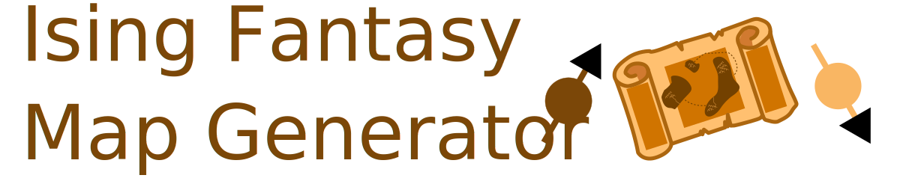
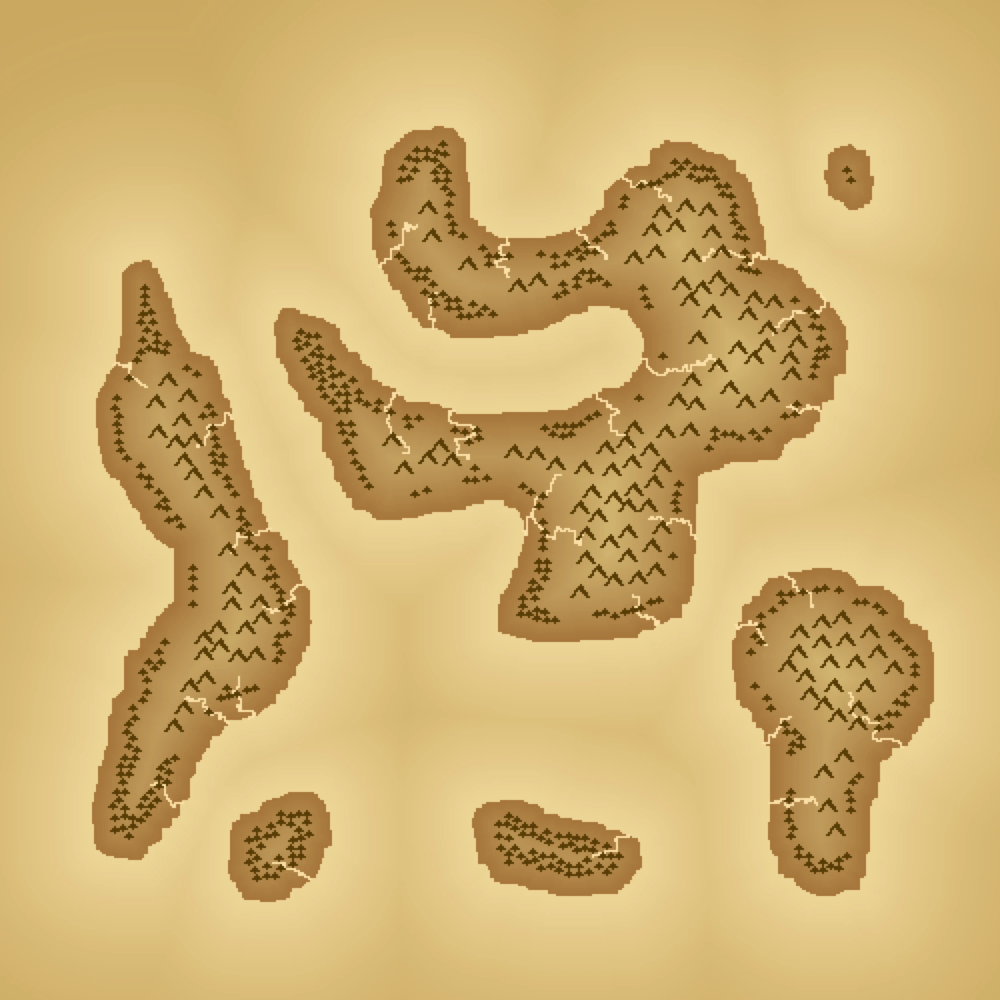

## Introduction

Ising Fantasy Map Generator is a C++ code for the procedural generation of fantasy world maps.



The algorithm generates sea/terrain patterns using a 2D spin-lattice whose dynamic is regulated by the Ising Hamiltonian. The lattice undergoes an annealing procedure that takes the system below its critical temperature, where macroscopic correlations are still present at a large scale.

A height map is generated starting from these sea/terrain patterns by using the distance from the "coastline."
Finally, trees, mountains, and rivers are generated using the height map.

> [!NOTE]
> The code can be upgraded by adding cities and roads within them. 
> Moreover, noise functions can be used, which will help avoid the uniformity often associated with distance-from-coastline-based approaches, as can be seen in the image generated so far by this code.


A detailed description of the whole procedure can be found [here](http://lucamorselli.me/blog/fantasy_map_generation_via_ising_model/).

## Installation

The only required dependencies are SDL2 and CMake. 

#### Linux

On Linux, you should be able to compile the code using the provided ```CMakeLists.txt```. 

Create a build directory inside the repository one as follow:
```bash
mkdir build && cd build
```
and then run cmake and make:
```bash
cmake ..
make
```

## Usage

To initiate the program, the lattice dimension and the desired number of generated images must be provided as command-line arguments.
```bash
./IsingFantasyMapGenerator --lattice-size <L> --num-generated-images <N>
```
or:
```bash
./IsingFantasyMapGenerator -L <L> -N <N>
```

> [!WARNING]
> The image on the cover was generated using the number of iterations that you can find hardcoded in the main.cpp file. However, the number of iterations to get a pleasing result depends on the lattice size and must be tuned. Using too many iterations below critical temperature will yield a sea-only map.


output example:
```bash

 ___     _                _____           _                          
|_ _|___(_)_ __   __ _   |  ___|_ _ _ __ | |_ __ _ ___ _   _         
| |/ __| | '_ \ / _`  |  | |_ / _` | '_ \| __/ _` / __| | | |        
| |\__ \ | | | | (_|  |  |  _| (_| | | | | || (_| \__ \ |_| |        
|___|___/_|_| |_|\__, |  |_|  \__,_|_| |_|\__\__,_|___/\__, |        
                  |___/                                 |___/         
 __  __                ____                           _             
|  \/  | __ _ _ __    / ___| ___ _ __   ___ _ __ __ _| |_ ___  _ __ 
| |\/| |/ _` | '_ \  | |  _ / _ \ '_ \ / _ \ '__/ _` | __/ _ \| '__|
| |  | | (_| | |_) | | |_| |  __/ | | |  __/ | | (_| | || (_) | |   
|_|  |_|\__,_| .__/   \____|\___|_| |_|\___|_|  \__,_|\__\___/|_|   
             |_|                                                    

-------------------------------------------------------------------------------- 
version : 1.0
--------------------------------------------------------------------------------                       
    

Starting annealing procedure for map #1
[========================================] 100% 
Freezing the lattice: 
[========================================] 100% 
Generating heightmap from spin lattice:
[========================================] 100% 
Generating rivers . . .
Generating mountains . . .
Generating trees . . .
Rendering the map . . .
Map saved into /home/mors/Documents/IsingFantasyMapGenerator/build/map1.bmp
```
